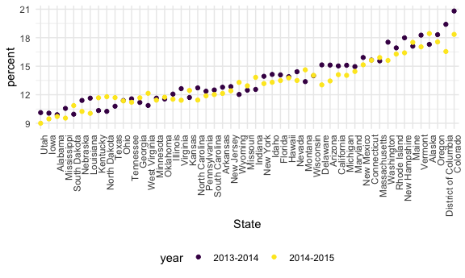

reading\_data
================
Yiqun Jin
10/21/2021

## String vectors

``` r
string_vec = c("my", "name", "is", "jeff")

str_detect(string_vec, "jeff") #strings are case sensitive
```

    ## [1] FALSE FALSE FALSE  TRUE

``` r
#str_replace(string_vec, "e", "This is an uppercase E")
str_replace(string_vec, "jeff", "")
```

    ## [1] "my"   "name" "is"   ""

regular expressions

``` r
string_vec = c(
  "i think we all rule for participating",
  "i think i have been caught",
  "i think this will be quite fun actually",
  "it will be fun, i think"
  )

str_detect(string_vec, "i think")
```

    ## [1] TRUE TRUE TRUE TRUE

``` r
str_detect(string_vec, "^i think") #`^` represent the beginning of the line
```

    ## [1]  TRUE  TRUE  TRUE FALSE

``` r
str_detect(string_vec, "i think$") # `$` represent the end of the line
```

    ## [1] FALSE FALSE FALSE  TRUE

``` r
string_vec = c(
  "Y'all remember Pres. HW Bush?",
  "I saw a green bush",
  "BBQ and Bushwalking at Molonglo Gorge",
  "BUSH -- LIVE IN CONCERT!!"
  )
str_detect(string_vec,"bush")
```

    ## [1] FALSE  TRUE FALSE FALSE

``` r
str_detect(string_vec,"[Bb]ush") #upper case or lower case, both fine
```

    ## [1]  TRUE  TRUE  TRUE FALSE

``` r
string_vec = c(
  '7th inning stretch',
  '1st half soon to begin. Texas won the toss.',
  'she is 5 feet 4 inches tall',
  '3AM - cant sleep :('
  )

str_detect(string_vec, "^[0-9][a-zA-Z]") #find everything that start with number and then a letter
```

    ## [1]  TRUE  TRUE FALSE  TRUE

``` r
string_vec = c(
  'Its 7:11 in the evening',
  'want to go to 7-11?',
  'my flight is AA711',
  'NetBios: scanning ip 203.167.114.66'
  )

str_detect(string_vec, "7.11") # `.` represent everything
```

    ## [1]  TRUE  TRUE FALSE  TRUE

``` r
string_vec = c(
  'The CI is [2, 5]',
  ':-]',
  ':-[',
  'I found the answer on pages [6-7]'
  )

str_detect(string_vec, "\\[") #the actual `[`
```

    ## [1]  TRUE FALSE  TRUE  TRUE

## Why factors are weird

``` r
factor_vec = factor(c("male","male", "female", "female"))
as.numeric(factor_vec)
```

    ## [1] 2 2 1 1

``` r
factor_vec = fct_relevel(factor_vec, "male")
factor_vec
```

    ## [1] male   male   female female
    ## Levels: male female

``` r
as.numeric(factor_vec)
```

    ## [1] 1 1 2 2

``` r
vec_sex = factor(c("male", "male", "female", "female"))
vec_sex
```

    ## [1] male   male   female female
    ## Levels: female male

``` r
as.numeric(vec_sex)
```

    ## [1] 2 2 1 1

``` r
vec_sex = fct_relevel(vec_sex, "male")
vec_sex
```

    ## [1] male   male   female female
    ## Levels: male female

``` r
as.numeric(vec_sex)
```

    ## [1] 1 1 2 2

\#\#NSDUH

``` r
nsduh_url = "http://samhda.s3-us-gov-west-1.amazonaws.com/s3fs-public/field-uploads/2k15StateFiles/NSDUHsaeShortTermCHG2015.htm"

table_marj = 
  read_html(nsduh_url) %>% 
  html_table() %>% 
  first() %>%
  slice(-1)

table_marj
```

    ## # A tibble: 56 × 16
    ##    State      `12+(2013-2014)` `12+(2014-2015)` `12+(P Value)` `12-17(2013-2014…
    ##    <chr>      <chr>            <chr>            <chr>          <chr>            
    ##  1 Total U.S. 12.90a           13.36            0.002          13.28b           
    ##  2 Northeast  13.88a           14.66            0.005          13.98            
    ##  3 Midwest    12.40b           12.76            0.082          12.45            
    ##  4 South      11.24a           11.64            0.029          12.02            
    ##  5 West       15.27            15.62            0.262          15.53a           
    ##  6 Alabama    9.98             9.60             0.426          9.90             
    ##  7 Alaska     19.60a           21.92            0.010          17.30            
    ##  8 Arizona    13.69            13.12            0.364          15.12            
    ##  9 Arkansas   11.37            11.59            0.678          12.79            
    ## 10 California 14.49            15.25            0.103          15.03            
    ## # … with 46 more rows, and 11 more variables: 12-17(2014-2015) <chr>,
    ## #   12-17(P Value) <chr>, 18-25(2013-2014) <chr>, 18-25(2014-2015) <chr>,
    ## #   18-25(P Value) <chr>, 26+(2013-2014) <chr>, 26+(2014-2015) <chr>,
    ## #   26+(P Value) <chr>, 18+(2013-2014) <chr>, 18+(2014-2015) <chr>,
    ## #   18+(P Value) <chr>

Let’s clean this up

``` r
marj_df = 
  table_marj %>% 
  select(-contains("P value")) %>% 
  pivot_longer(
    -State,
    names_to = "age_year",
    values_to = "percent"
  ) %>% 
  #separate(age_year, into = c("age", "year"),-11) %>% 
  separate(age_year, into = c("age", "year"),"\\(") %>% 
  mutate(year = str_replace(year, "\\)", ""),
         percent = str_replace(percent, "[a-c]$", ""),
         percent = as.numeric(percent)) %>% 
  filter(!State %in% c("Total U.S.", "Northeast", "Midwest", "South", "West"))
```

Do dataframe stuff

Let’s make a plot that only show age 12-17

``` r
marj_df %>% 
  filter(age == "12-17") %>% 
  mutate(State = fct_reorder(State, percent)) %>% 
  ggplot(aes(x = State, y = percent, color = year)) +
  geom_point() +
  theme(axis.text.x = element_text(angle = 90, hjust = 1))
```


